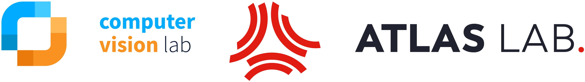

## Good to see you here!

I am a PhD candidate in the ATLAS Lab, which is a collaboration between the [University of Amsterdam](https://www.uva.nl/) and [TomTom](https://www.tomtom.com/). The goal of the ATLAS lab, part of the [Innovation Center for Artificial Intelligence (ICAI)](https://icai.ai/) and [Computer Vision Group](https://ivi.fnwi.uva.nl/cv/), is the development new machine learning-based algorithms for high definition map creation for self-driving vehicles. My work is focused on Structured Segmentation, and I am supervised by [Prof. dr. Theo Gevers](https://staff.fnwi.uva.nl/th.gevers/), [dr. Martin Oswald](https://people.inf.ethz.ch/moswald/) and [dr. Sezer Karaoglu](http://staff.science.uva.nl/~sezerk).

In my work, I mainly focus on leveraging from structure in visual data and implicitly or explicitly imposing structural properties for the tasks of semantic, instance and panoptic segmentation. I explore  possibilities to extend traditional segmentation networks with theories of graphical models. 

### Publications

_Ulger, O., Wang, Y., Galama, Y., Karaoglu, S., Gevers, T., Oswald, M. R., 2023. Relational Prior Knowledge Graphs for Detection and Instance Segmentation. In ICCV2023 SG2RL_ [[paper](https://arxiv.org/abs/2310.07573)]

_Ulger, O., Wiederer, J., Ghafoorian, M., Belagiannis, V., Mettes, P., 2022. Multi-Task Edge Prediction in Temporally-Dynamic Video Graphs. In BMVC2022_ [[paper](https://arxiv.org/abs/2212.02875)]

_Ulger, O., Stol, M., Mensink, T., 2018. Evaluating the Effectiveness of Adversarial Patch Attacks on Convolutional Neural Networks. In BNAIC2018_ [[paper](https://www.dropbox.com/s/80uo3wsxtgngzmk/Ulger_Stol_Mensink_BNAIC2018.pdf?dl=0)]